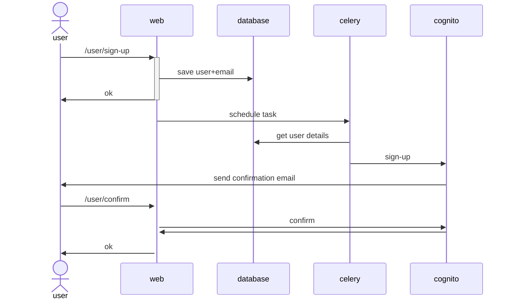
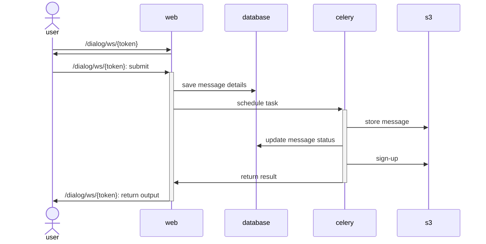

### Description

Simple service for user interaction with database and s3

### Registration

```mermaid
sequenceDiagram
actor u as user
participant w as web
participant db as database
participant c as celery
participant a as cognito

u ->>+ w: /user/sign-up
w ->> db: save user+email
w ->>- u: ok
w ->> c: schedule task
c ->> db: get user details
c ->> a: sign-up
a ->> u: send confirmation email

u ->>+ w: /user/confirm
w ->> a: confirm
a ->> w: 
w ->> u: ok


```

### Generation

```mermaid
sequenceDiagram
actor u as user
participant w as web
participant db as database
participant c as celery
participant a as s3

u ->> w: /dialog/ws/{token}
w ->> u: 
u ->>+ w: /dialog/ws/{token}: submit
w ->> db: save message details
w ->>+ c: schedule task
c ->> a: store message
c ->> db: update message status
c ->> a: sign-up
c ->>- w: return result
w ->>- u: /dialog/ws/{token}: return output

```