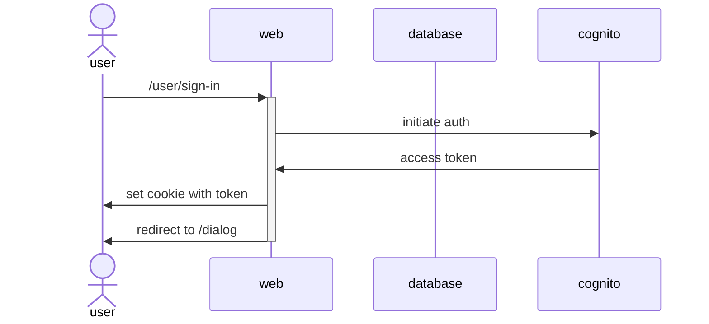
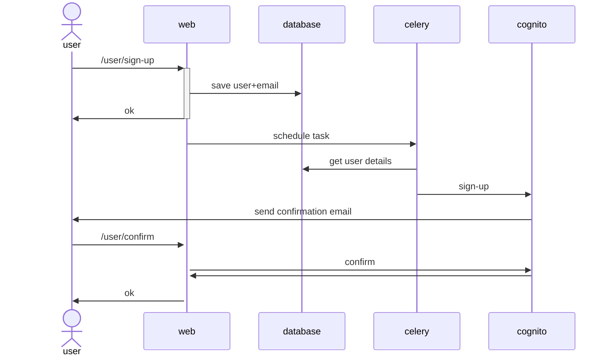
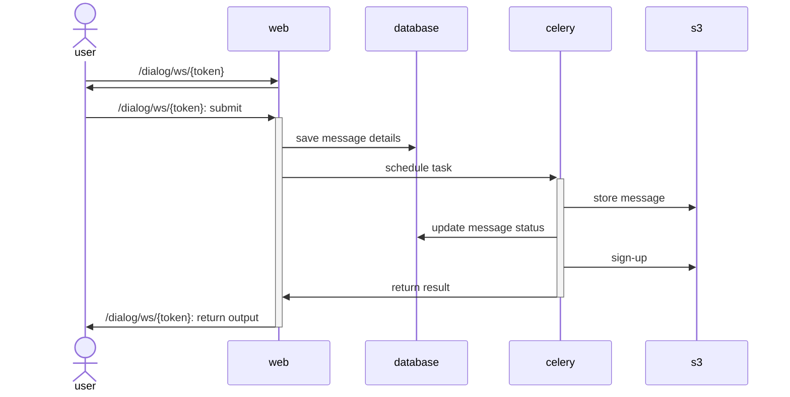

## Description

Simple service for user interaction with database and s3

## Usage

Set following variables in env or put the into .env file:
- LOCALSTACK_AUTH_TOKEN

These are required for cognito to send emails
- SMTP_HOST
- SMTP_PORT
- SMTP_USER
- SMTP_PASS

For connection to some local db, override database URLs:
- DATABASE_URL_SYNC
- DATABASE_URL_ASYNC
- CELERY_RESULT_BACKEND (either override or set smth other than db)

### deployment
For deployment just run `make run`

### lde
For development with hot-reload run `make dev`

## Functionalities

### SignIn

### Registration

### Generation

